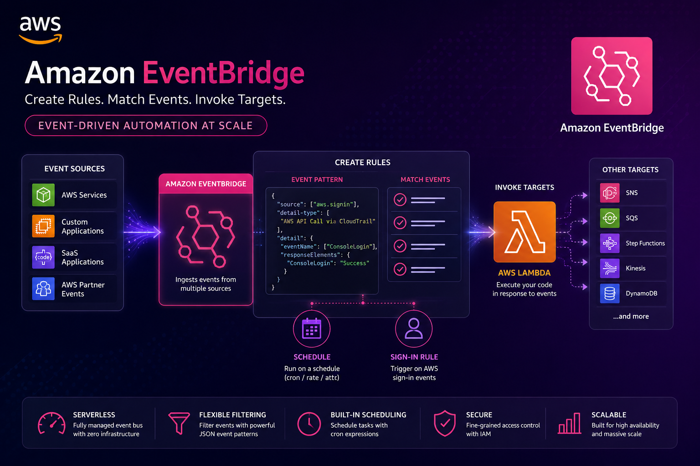
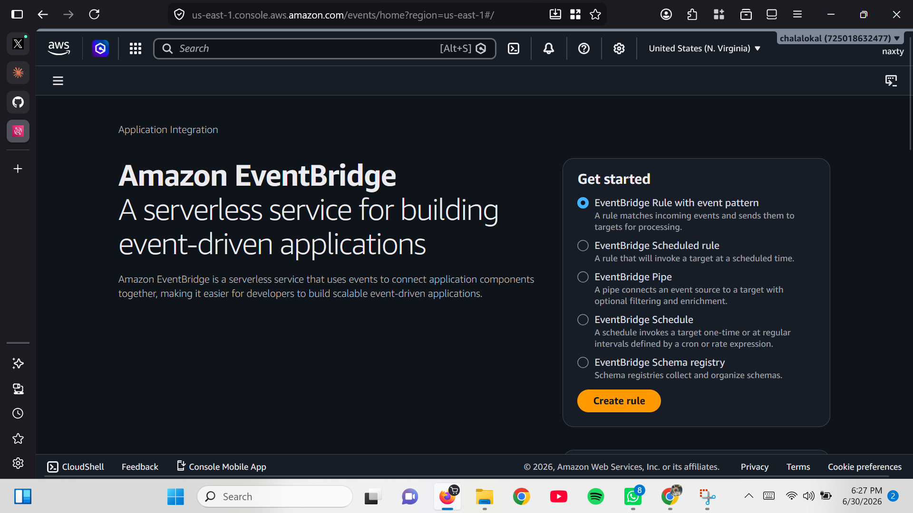
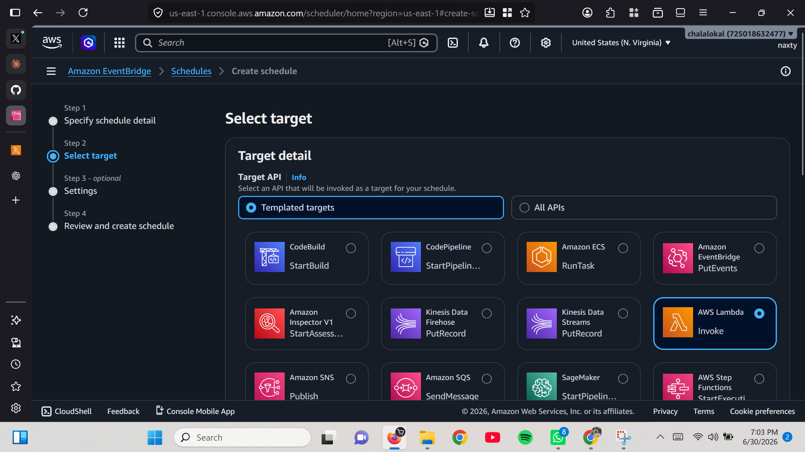
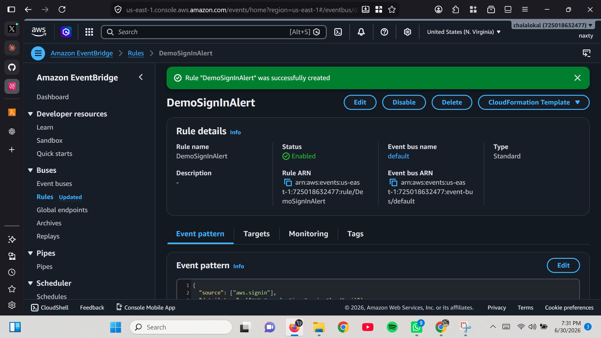
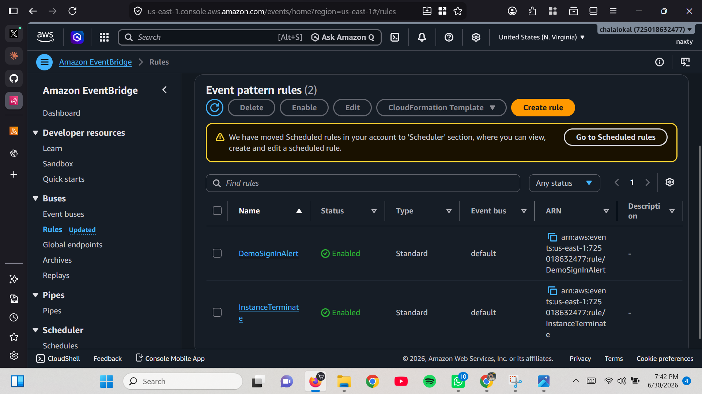

# AWS EventBridge Event Automation



---

## Introduction
This project demonstrates automating workflows using Amazon EventBridge. It covers scheduled rules to trigger a Lambda function and event-based rules to send alerts on AWS sign-ins or EC2 state changes.

---

## Prerequisites
Ensure you have:
- An active AWS account.
- Basic knowledge of AWS Lambda, EventBridge, and SNS.
- IAM permissions for EventBridge, Lambda, and SNS.

---

## 🏗️ Architecture

```text
                      +----------------------+
                      |   Amazon EventBridge |
                      +----------+-----------+
                                 |
             +-------------------+-------------------+
             |                                       |
             |                                       |
     Scheduled Rule                         Event Pattern Rule
 (Rate: Every 1 Hour)             (AWS Console Sign-In via CloudTrail)
             |                                       |
             |                                       |
      Invoke Lambda                         Match CloudTrail Event
             |                                       |
      +------+-------+                       +--------+--------+
      |              |                       |                 |
 Amazon Lambda                  Amazon SNS Topic (Email Alert)
                                       |
                                       |
                              Email Notification

                     Additional Rule

            EC2 Instance State = Terminated
                       |
                Amazon EventBridge
                       |
                 Amazon SNS Topic
                       |
                Email Notification
```

---

## Steps

### Step 1: Create a Scheduled Rule
1. In the AWS Console, search for "Amazon EventBridge."
2. Select EventBridge and click "Create a Schedule."
3. Name the schedule: `Invoke Lambda Function Every Hour`.
4. Choose a rate-based schedule: every 1 hour.
5. Disable flexible time window and click "Next."



---

### Step 2: Add a Target
1. Under "Select Target," choose "Templated Targets."
2. Select Lambda and create a new function named `DemoLambda`.
3. Keep defaults and click "Next."



---

### Step 3: Create the Schedule
1. Review all settings and click "Create Schedule."

---

### Step 4: Create a Sign-In Alert Rule
1. In EventBridge, select "Create Rule" under Event Pattern.
2. Search "sign-in" and choose "AWS Console Sign-In via CloudTrail."
3. This rule triggers on each sign-in event.
4. Set the target to an SNS topic for email alerts.
5. Name the rule: `DemoSignInAlert`, then click "Next."



---

### Step 5: Create an EC2 State Change Rule
1. Create another rule for EC2 instance state changes.
2. Filter on the state "Terminated."
3. Set the target to the SNS topic to receive alerts.



---

## Conclusion

This project shows how EventBridge can automate responses to scheduled events (like Lambda) and real-time events (like sign-ins or EC2 terminations). Adjust the rules as needed to fit your automation needs.

---

## 👨‍💻 Author

**Elochukwu Princewill**

Cloud | Cybersecurity | AWS Solutions Architecture | Linux | Networking

> *Learning by building real-world cloud infrastructure projects.*

---

## ⭐ If you found this project helpful

Feel free to ⭐ star this repository and explore my other AWS hands-on projects as I continue building my cloud engineering portfolio.
